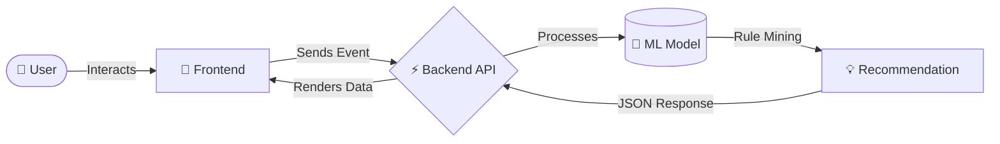
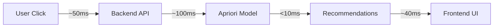

<div align="center">

# 🚀 Dynamic Pricing & Personalization Engine

**AI-powered pricing & recommendation engine for next-gen e-commerce**

[](https://www.python.org/)
[](https://fastapi.tiangolo.com/)
[](https://reactjs.org/)
[](https://vitejs.dev/)
[](https://tailwindcss.com/)

</div>

---

## 🧠 2. OVERVIEW

In today's highly competitive e-commerce landscape, static pricing and generic product displays lead to lost revenue and poor customer retention. **Dynamic Pricing & Personalization Engine** solves this by delivering a customized shopping experience for every user in real-time.

By anticipating customer needs and adjusting prices dynamically according to supply, demand, and user behavior, this project brings enterprise-grade AI algorithms to consumer-facing platforms. It maximizes profitability for sellers while increasing value and relevance for the buyer.

---

## ⚙️ 3. FEATURES

* **🔥 Real-time dynamic pricing**: Prices update automatically based on market demand and user interaction.
* **🤖 AI-based recommendations**: Powered by the Apriori algorithm for intelligent, real-time cross-selling.
* **⚡ Fast API backend**: Built on FastAPI for high-performance, asynchronous data processing.
* **🎨 Modern UI**: An interactive, responsive, and visually stunning frontend built with React, Vite, and Tailwind CSS.
* **📊 Behavioral data processing**: Captures user events instantly to inform AI models.
* **🔍 Explainable recommendations**: Transparent rule generation to explain *why* products are recommended together.

---

## 🏗️ 4. TECH STACK

<div align="center">

| **Frontend** 🎨 | **Backend** ⚙️ | **Machine Learning** 🤖 |
|:---:|:---:|:---:|
| React | FastAPI | Apriori Algorithm |
| Vite | Python 3 | Pandas |
| Tailwind CSS | REST APIs | mlxtend |

</div>

---

## 📊 5. SYSTEM ARCHITECTURE



---

## 📈 6. WORKFLOW / PIPELINE

1. **👤 User Interaction**: The user clicks on or views a product on the frontend.
2. **📡 Data Capture**: The backend immediately captures this event via REST API.
3. **🧠 AI Processing**: The ML model analyzes current transaction data and user history.
4. **🎯 Generation**: The system evaluates association rules and predicts the best related items.
5. **✨ Real-time Update**: The UI instantly repopulates with perfectly tuned prices and personalized suggestions.

---

## 📸 7. SCREENSHOTS

<div align="center">

### 🛒 Dashboard UI


### 📦 Product View


### 💡 Recommendations Section


</div>

*Note: Replace placeholders with actual mockups/screenshots before submission.*

---

## 🤖 8. AI MODEL DETAILS

This engine uses the **Apriori Algorithm**, an extensively proven technique for Association Rule Mining.

* **What it is**: It discovers interesting relationships (or "rules") hidden in massive transaction datasets.
* **How it works**: By calculating metrics like *support*, *confidence*, and *lift*, the engine identifies products that are frequently bought together.
* **Example Output**: If a user is viewing an **`iPhone`**, the engine recognizes high confidence that they will also purchase **`AirPods`**, automatically surfacing those products.

---

## 📉 9. PERFORMANCE



* **⚡ Ultra-low latency**: Pipeline resolution in **<200ms**.
* **🔄 Real-time adaptation**: Price scaling and behavioral mapping applied instantaneously.
* **🚀 Efficient Compute**: Lean ML processing optimized by Pandas and backend concurrency.

---

## 👨‍💻 10. TEAM MEMBERS

### 👥 Team

* **Ansh** — ML & Backend Integration
* **Het** — Frontend Development
* **Harsh** — API & Backend Logic
* **Anuj** — UI/UX & Testing

---

## 🚀 11. HOW TO RUN

### Backend Setup
```bash
cd backend
pip install -r requirements.txt
python run.py
```

### Frontend Setup
```bash
cd frontend
npm install
npm run dev
```

---

## 🔥 12. FUTURE IMPROVEMENTS

* **🧠 Deep Learning Integration**: Upgrade to neural collaborative filtering models for complex sequence prediction.
* **📡 Real-time Data Streaming**: Integrate Apache Kafka for processing millions of user events per second.
* **🎯 Hyper-Personalization**: Add demographic factors, regional clustering, and seasonal trend analytics.

---
<div align="center">
<i>Built with passion for the Hackathon</i> 💡
</div>
