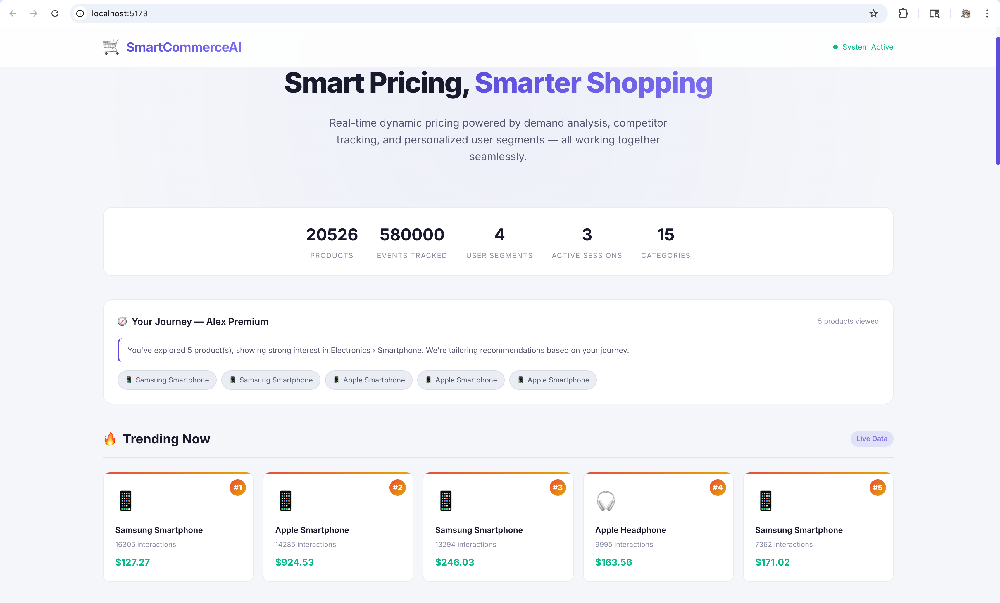
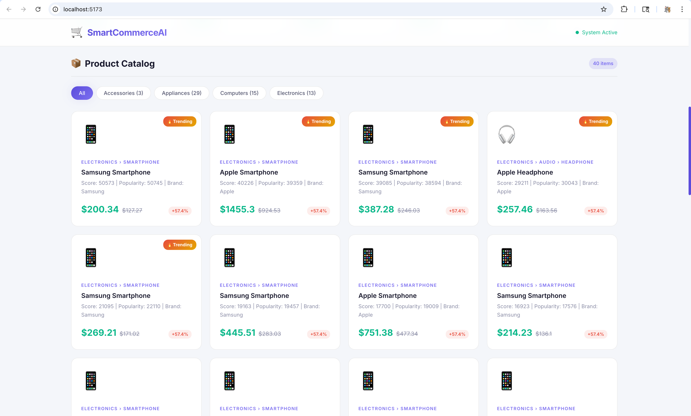
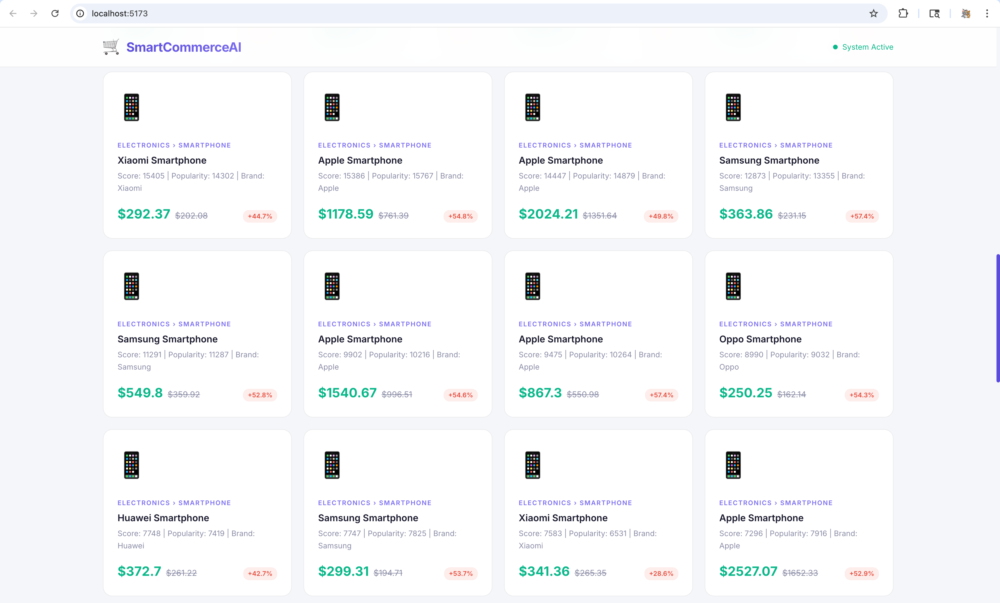
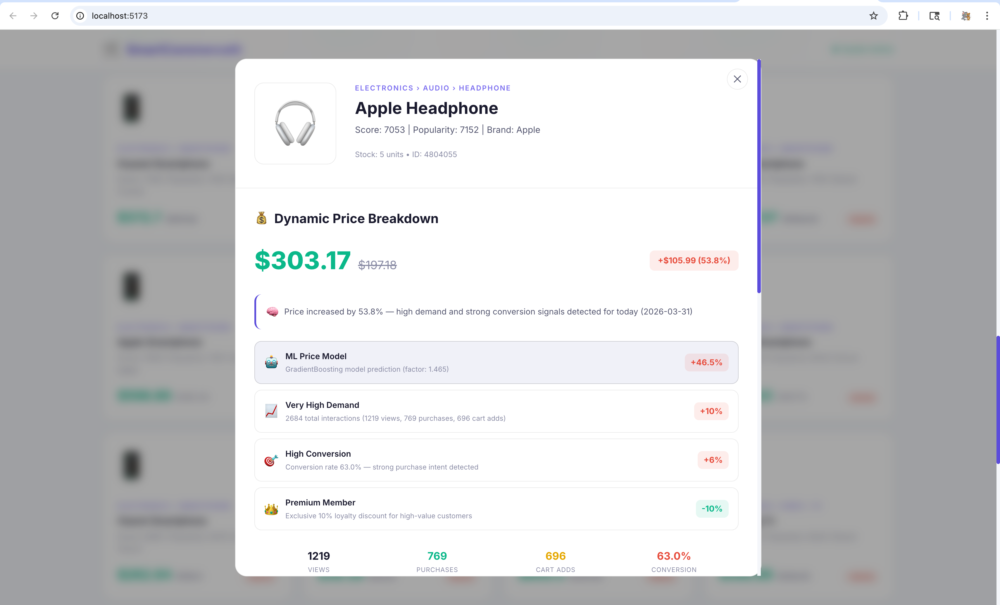
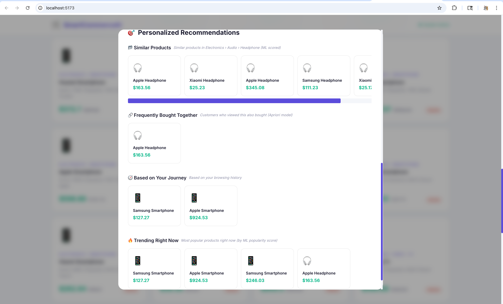
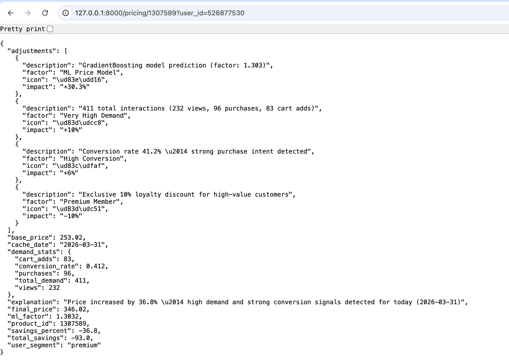
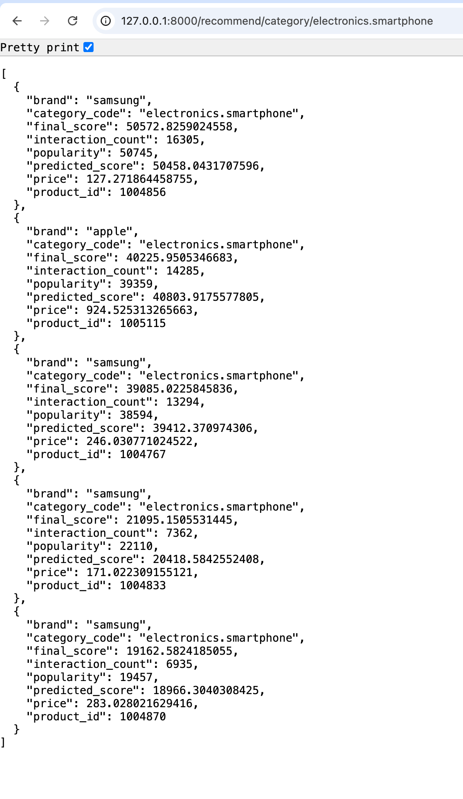
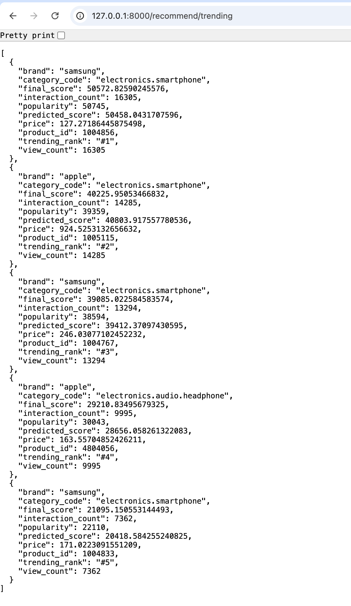

# 🏆 Hackathon Project

## 🎯 Tic Tech Toe '26  
**Dhirubhai Ambani Institute of Information and Communication Technology (DA-IICT), Gandhinagar**

---

## 💡 Problem Statement 3  
**E-Commerce Dynamic Pricing and Personalization Engine Using Real-Time Behavioral Signals**

---

## 🧙 Team Name  
**Hogwarts Tech Wizards**

---

## 👥 Team

- **Het Limbani (Team Leader)** — ML & Backend Development  
- **Ansh Patoliya** — ML & Frontend Development  
- **Harsh Patel** — API, Backend & Frontend Logic  
- **Anuj Raval** — ML Development  

---

<div align="center">

# 🛒 SmartCommerceAI: Dynamic Pricing & Personalization Engine

**AI-powered pricing & recommendation engine for next-gen e-commerce**

[](https://www.python.org/)
[](https://scikit-learn.org/)
[](https://pandas.pydata.org/)
[](https://fastapi.tiangolo.com/)
[](https://reactjs.org/)
[](https://vitejs.dev/)


</div>

---

## 1. Overview

In the modern e-commerce landscape, static pricing models and "one-size-fits-all" product displays lead to missed revenue opportunities and high customer churn. 🛒  

**SmartCommerceAI** is an end-to-end intelligence layer designed to transform static storefronts into high-performance, adaptive ecosystems.

By leveraging real-time data streams and advanced Machine Learning, the engine optimizes the two most critical drivers of e-commerce success:

- 💰 **Profit Margins**
- 🎯 **User Engagement**

---

## 🎯 Core Objectives

### 💵 Price Optimization
Move beyond fixed costs to **Value-Based Pricing** by analyzing real-time market signals.

### 🧠 Hyper-Personalization
Shift from generic catalogs to **curated experiences** based on individual user behavior.

### 🛡️ Revenue Protection
Balance competitive discounting with automated **price floors** to ensure sustainable margins.

---

## 2. How It Works

<details>
<summary>Click to expand</summary>

### 🔍 Demand-Sensing Intelligence
- Uses **Gradient Boosting Regressor**
- Analyzes:
  - Traffic spikes
  - Conversion rates
  - Cart-addition ratios  
- Detects "viral" demand and adjusts prices dynamically for maximum profit.

---

### 👤 Behavioral Segmentation
- Performs real-time **RFM (Recency, Frequency, Monetary) analysis**
- Classifies users into:
  - 💎 High Spenders (loyalty-focused)
  - 💸 Low Spenders (price-sensitive)
- Applies **targeted discounts** only where needed.

---

### 🛍️ Discovery Engine
- Uses **Apriori Algorithm**
- Identifies:
  - Frequently Bought Together products
  - Hidden purchase patterns  
- Recommends **Next-Best-Offers** to increase **Average Order Value (AOV)**.

</details>

---

## ⚙️ 3. FEATURES

* **🔥 Real-time dynamic pricing**: Prices update automatically based on market demand and user interaction.
* **🤖 AI-based recommendations**: Powered by the Apriori algorithm for intelligent, real-time cross-selling.
* **⚡ Fast API backend**: Built on FastAPI for high-performance, asynchronous data processing.
* **🎨 Modern UI**: An interactive, responsive, and visually stunning frontend built with React, Vite, and Tailwind CSS.
* **📊 Behavioral data processing**: Captures user events instantly to inform AI models.
* **🔍 Explainable recommendations**: Transparent rule generation to explain *why* products are recommended together.

---

## 🏗️ 4. Tech Stack

<div align="center">

| **Frontend** 🎨 | **Backend** ⚙️ | **Data Handling** 📊 | **Machine Learning** 🤖 |
|:---:|:---:|:---:|:---:|
| React.js | FastAPI / Flask | Pandas & NumPy | Gradient Boosting (GBR) |
| Vite | Python 3.9+ | Feature Engineering | Apriori & Association Rules |
| Tailwind CSS | RESTful APIs | Scikit-Learn Preprocessing | Polynomial Features |
| Axios | Joblib / Pickle | Log Transformation | Hyperparameter Tuning |

</div>

---

## 🧠 Deep Dive: Model Architecture

### ⚡ Core Pricing Engine
- **Gradient Boosting Regressor (GBR):**  
  Powers the dynamic pricing system by learning complex, non-linear relationships between:
  - Demand fluctuations  
  - User behavior  
  - Market signals  

  Unlike traditional linear models, GBR adapts to changing patterns and identifies optimal price points in real time.

---

### 🔗 Feature Engineering Layer
- **Polynomial Features:**  
  Captures interaction effects between variables.  
  Example:
  - High Views + Low Conversion → Indicates price sensitivity  
  - High Views + High Cart Adds → Indicates strong demand  

  This helps the model understand deeper behavioral patterns beyond simple metrics.

---

### 📊 Data Processing Pipeline

- **Normalization (Robust Scaling):**  
  Handles extreme outliers in traffic and pricing data, ensuring stable model performance.

- **Log Transformation:**  
  Applied to skewed demand distributions to:
  - Stabilize variance  
  - Improve prediction accuracy  
  - Enhance model convergence  

- **Feature Aggregation:**  
  Converts raw event logs into meaningful product-level insights such as:
  - View-to-cart ratio  
  - Conversion rate  
  - Demand intensity  

---

## 📊 5. SYSTEM ARCHITECTURE


---

## 📈 6. WORKFLOW / PIPELINE

1. **👤 User Interaction**: The user clicks on or views a product on the frontend.
2. **📡 Data Capture**: The backend immediately captures this event via REST API.
3. **🧠 AI Processing**: The ML model analyzes current transaction data and user history.
4. **🎯 Generation**: The system evaluates association rules and predicts the best related items.
5. **✨ Real-time Update**: The UI instantly repopulates with perfectly tuned prices and personalized suggestions.

---

## 📸 7. SCREENSHOTS

<div align="center">

| 🛒 Dashboard 1 | 🛒 Dashboard 2 | 🛒 Dashboard 3 | 📦 Product View 1 |
|:--------------:|:--------------:|:--------------:|:-----------------:|
|  |  |  |  |

| 📦 Product View 2 | 💰 Pricing API | 📂 Category API | 🔥 Trending API |
|:-----------------:|:-------------:|:---------------:|:--------------:|
|  |  |  |  |

</div>

---

## 🤖 8. AI Model Details

The engine operates on a **multi-model architecture**, combining:
- 🔍 Unsupervised pattern recognition  
- 📈 Supervised regression  

This hybrid approach powers both **product discovery** and **revenue optimization**.

---

## 🛒 1. Product-Level Recommendation (Apriori)

<details>
<summary>Click to expand</summary>

### 🔗 Overview
The "Frequently Bought Together" engine is powered by **Association Rule Mining (Apriori Algorithm)**.

### ⚙️ The Logic
- Identifies hidden relationships in large-scale transaction datasets  
- Analyzes **co-occurrence patterns** between products  

### 📊 Key Metrics
- **Support:** Frequency of itemset occurrence  
- **Confidence:** Probability of buying item B given item A  
- **Lift:** Strength of association (filters random correlations)  

### 💡 Example
If a user views an **iPhone**, the model detects a strong association with **AirPods** and recommends them instantly.

</details>

---

## 📂 2. Category-Based Personalization

<details>
<summary>Click to expand</summary>

### ❄️ Cold Start Solution
Handles users with little or no interaction history.

### ⚙️ The Logic
- Falls back to a **Category-Heuristic Model**  
- Uses **cross-category affinity** when product-level rules are unavailable  

### 🎯 Contextual Awareness
- Recommends top-performing products from:
  - Same `category_code`  
  - Related sub-categories  

Ensures users always see **relevant recommendations**, even with limited data.

</details>

---

## 📈 3. Dynamic Pricing Engine (Gradient Boosting)

<details>
<summary>Click to expand</summary>

### 🧠 Overview
Acts as the **"Revenue Brain"** of the system using **Elasticity-Based Pricing**.

### ⚙️ Algorithm
- **GradientBoostingRegressor (GBR)**

### 🔄 Process

1. **Feature Extraction**
   - Log_Demand  
   - Conversion_Rate  
   - Cart_Ratio  

2. **Predictive Modeling**
   - Builds an ensemble of decision trees  
   - Predicts **Optimal Price Factor** *(0.7x → 1.5x of base price)*  

3. **User-Aware Adjustment**
   - Applies **User Segmentation (AOV-based)**  
   - Offers targeted **conversion discounts** to price-sensitive users  

</details>

---

## 🛡️ 4. Business Guardrails (Safety Layer)

<details>
<summary>Click to expand</summary>

### ⚖️ Purpose
Ensures AI-driven decisions remain **safe, stable, and profitable**.

### 🔒 Rules Implemented

- **Price Floor:**  
  No product price drops below **70% of original cost**, protecting margins  

- **Inventory Buffer:**  
  Limits aggressive pricing when stock levels are critically low  
  → Prevents overselling at reduced margins  

</details>

---

## 8. System Intelligence Summary

- 🧠 Hybrid AI (Unsupervised + Supervised)  
- 🎯 Personalized recommendations + pricing  
- 💰 Revenue optimization with safety constraints  
- ⚡ Real-time adaptive decision-making  

---

## 🚀 9. Project Structure
```
SmartCommerceAI/
│
├── backend/
│   ├── app/
│   │   ├── routes/
│   │   │   └── recommendation_routes.py     # API endpoints (pricing & recommendations)
│   │   ├── services/
│   │   │   └── recommendation_service.py    # Core ML logic & calculations
│   │   └── __init__.py
│   │
│   ├── data/
│   │   ├── Dataset.csv                     # Raw interaction logs
│   │   ├── model.pkl                       # Trained pricing model
│   │   ├── recommendation_model.pkl        # Association rules model
│   │   └── product_meta.csv                # Product metadata for API
│   │
│   ├── dynamic_pricing_model.py            # Pricing model training
│   ├── cat_recommend_model.py              # Category model (Polynomial Degree 2)
│   ├── prod_recommend_model.py             # Recommendation model training
│   ├── requirements.txt                    # Python dependencies
│   └── run.py                             # Flask app entry point
│
├── frontend/
│   ├── public/
│   ├── src/
│   │   ├── assets/
│   │   ├── api.js                         # API integration
│   │   ├── App.jsx                        # Main app logic
│   │   ├── App.css
│   │   └── main.jsx
│   │
│   ├── index.html
│   └── package.json                      # Node dependencies
│
└── README.md
```
---

## 🚀 10. HOW TO RUN

### Backend Setup
```bash
cd backend
pip install -r requirements.txt
python run.py
```

### Frontend Setup
```bash
cd Frontend
npm install
npm run dev
```

---


